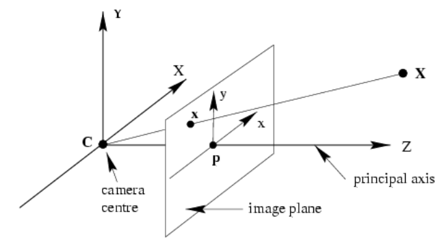

# Galactic Positioning System (G-PS)
<p align="center">
  
</p>

## Overview
**Galactic Positioning System (G-PS)** is a Python-based astronomical navigation system that estimates an observer's position in space by comparing simulated star field images with actual sky images. It utilizes Gaia star data and advanced image similarity techniques to determine the most likely location and orientation of the observer in a 3D star map.

## Features
- **Star Data Processing:** Loads and processes real astronomical data from the Gaia mission.
- **Simulated Sky Imaging:** Generates star field projections based on different observer locations and orientations.
- **Image Comparison:** Uses structural similarity analysis (SSIM) to match a real sky image with simulated star maps.
- **Position Estimation:** Identifies the best-matching observer position based on the closest star field match.
- **3D Visualization:** Interactive 3D visualization of estimated positions, stars, and orientation vectors using Plotly.

## Dependencies
Ensure you have the following Python libraries installed:

```bash
pip install numpy pandas matplotlib scikit-image scipy pillow plotly
```

## How It Works
1. **Load Star Data:**
   - Reads a Gaia star catalog CSV file and extracts celestial coordinates (RA, DEC, distance).
   - Converts celestial coordinates into a 3D cartesian representation.

2. **Generate Simulated Star Images:**
   - Computes the observer's view based on predefined locations and orientations.
   - Projects the star positions onto a 2D plane to mimic what an observer sees.

3. **Process Real Sky Image:**
   - Loads a real sky image, converts it to grayscale, and extracts bright spots (stars).

4. **Compare Simulated vs. Real Images:**
   - Measures similarity using SSIM to find the closest match.

5. **Estimate Position & Orientation:**
   - Outputs the estimated position and viewing direction in space.

6. **Visualize in 3D:**
   - Displays a 3D scatter plot of star positions, the estimated observer location, Earth, and the observer’s look vector.

## Understanding the Geometry of Star Projection
The process of projecting a 3D star position onto a 2D plane follows the principles of perspective projection. Given a star's 3D coordinates `(x, y, z)`, the 2D projected coordinates `(x', y')` are calculated as:

\[ x' = \frac{x}{z}, \quad y' = \frac{y}{z} \]

### Explanation:
- The observer's viewpoint is positioned at the origin, looking along the z-axis.
- As light from distant stars enters the observer's view, the stars appear on a virtual 2D image plane perpendicular to the viewing direction.
- The transformation formulas above ensure that stars further away (larger `z`) appear closer to the center, maintaining correct depth perception.
- This technique is fundamental to rendering celestial objects in astronomy software, planetariums, and navigation systems like G-PS.

<p align="center">
  
</p>

## Usage
Modify the file paths as needed and run the script:
```bash
python galactic_positioning.py
```
Ensure you have:
- A Gaia star catalog CSV file (e.g., `dataGaia.csv`)
- A real star field image (e.g., `test1-celestia.png`)

## Example Output
- **Estimated Position:** `[x, y, z]` (light-years from reference point)
- **Estimated Orientation:** `[yaw, pitch, roll]` (degrees)
- **Best Match Index & Similarity Score**
- **3D Plot of the Estimated Position and Look Vector**

## Future Improvements
- Expand to include more precise galactic coordinates.
- Optimize the image comparison algorithm.
- Implement real-time star tracking.
- Extend compatibility for different astronomical datasets.
